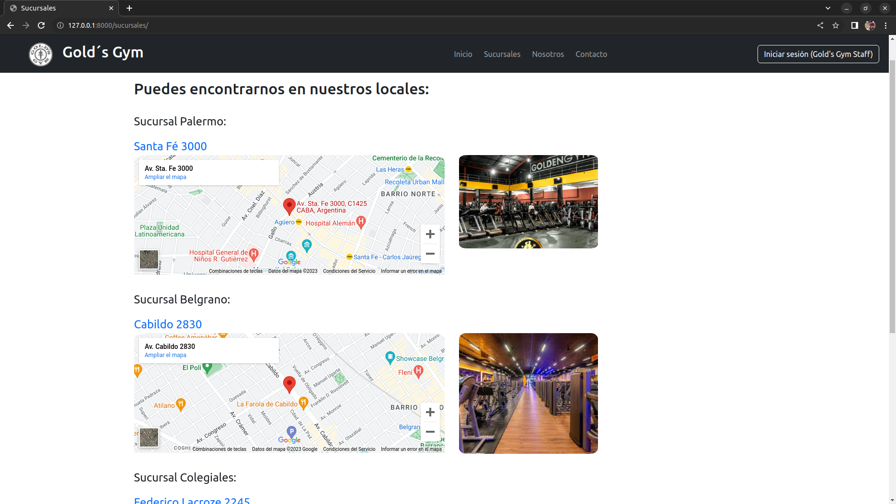

<h1 align="center"> Proyecto integrador grupal Django - Codo a Codo 2023 </h1>
Nuestro proyecto grupal consiste en hacer una página web para administrar un gimnasio, donde a un proyecto previo hecho con html, js y css, le haremos el backend con Django para registrar/eliminar/dar de baja (entre otras funcionalidades) a los alumnos/profesores/clases/etc. Solo será utilizado por los trabajadores del gimnasio.

- Templates hechos con html, css y js <p align="left"> <a href="https://www.w3schools.com/css/" target="_blank" rel="noreferrer">  </a> <a href="https://www.w3.org/html/" target="_blank" rel="noreferrer">  </a> <a href="https://developer.mozilla.org/en-US/docs/Web/JavaScript" target="_blank" rel="noreferrer">  </a></p>
- Django para backend <p align="left"> <a href="https://www.djangoproject.com/" target="_blank" rel="noreferrer">  </a>  <a href="https://www.python.org" target="_blank" rel="noreferrer">  </a> </p>
- PostgreSQL como visualizador de Database<p align ="left"> <a href="https://www.postgresql.org" target="_blank" rel="noreferrer">  </a> </p>

## Authors
- [Fabian Gomez Laguna](https://www.github.com/fabianejgl)
- [Yamila](https://github.com/yamilaq)
- [Evana Sabatella](https://github.com/EvanaSabatella1989)

## Requerimientos
Clonar el repositorio en una carpeta:
```bash
  git clone https://github.com/fabianejgl/django_proyecto.git
```
Luego crear un entorno virtual con python y activarlo:

En Linux:
```bash
  source /entornos/entorno_django/bin/activate
```
En Windows:
```bash
  source /entornos/entorno_django/Scripts/activate
```
Correr el siguiente comando para instalar los requerimientos necesarios:
```bash
  pip install -r requirements.txt
```
Correr el runserver (usar python o python3), puede usar puerto 8000 (default) o elegir otro:
```bash
  python3 manage.py runserver 8000
```
## Resumen
#### Consideramos que el trabajo debía centrarse en el back-end por lo que fue mucho más exhaustivo  su desarrollo ya que la idea era hacer la lógica los modelos, views, formularios, Cruds, etc. y como consecuencia no le dimos mucha importancia al front-end de la página que era de el curso de Python anterior.

En la página de inicio se puso como primer elemento un video sobre el lugar:

<br>
<br>
Bajando se pueden ver los cursos que figuran en la base de datos, donde cada uno se muestra con su categoría, descripción, profesor, foto y desde qué fecha está disponible:

<br>
<br>
En la pestaña de sucursales se muestran las sucursales guardadas (y que están "activas") de la base de datos, primero se muestra su nombre, luego la dirección guardada que está dentro de una etiqueta <a> que redirije al link en google maps. Finalmente se muestra un iframe y una imagen que también están guardada en la base de datos, ambas se piden a la hora de agregar una nueva sucursal:

<br>
<br>
En la pestaña de contacto la idea fue implementarla para que la persona que quiera información reciba un primer mail automático filtrando las clases por la categoría y día (opcional) seleccionados. En caso de tener dudas específicas se le avisa que recibirá otro mail dentro de las 48hs por parte de un miembro del Staff. La implementación del mail automático está hecha en views.py de la app administración. También surgió la idea de que las personas que se comuniquen se añadan a la base de datos como clientes "no activos" pero no está implementada la lógica:

<br>
<br>
El inicio de sesión solo está implementado para que miembros del Staff puedan iniciar sesión, la idea es que el Administrador General sea el que cree las cuentas y los miembros solo pueden modificar sus contraseñas, en caso de olvidarla tendrían que hablar con el Admin. Gral.

<br>
<br>
En admin podrán iniciar sesión y es a donde tienen que venir para restaurar o borrar permanentemente un elemento, la idea es que solo el Admin Gral. tenga acceso a esta página y que los otros se manejen desde la que se mostrará en el siguiente apartado. El admin. gral será el único que pueda crear nuevos usuarios y borrar de forma permanente elementos, los otros podrán acceder a ver simplemente, pero no debeŕian tener permitido borrar o editar:

<br>
<br>
Índice de la página de administración hecha para los miembros del Staff. Es requerido iniciar sesión como miembro de Staff para entrar a está página, o a cualquiera dentro del menú de navegación. Cabe aclarar que la eliminación de elementos es una baja "lógica", se pone en False un elemento Bool llamado "Baja", empieza por defecto en False al agregar un elemento:

<br>
<br>
Acá se muestra un ejemplo de lo que tienen todos los modelos al agregar uno nuevo, en todos los casos se toma en cuenta que no se repitan por ejemplo alumnos inscriptos a una materia más de una vez, que dos alumnos no tengan mismo DNI o Matrícula, o que 2 profesores tengan mismo legajo, entre otras cosas. Además los filtros son funcionales, pueden usarse varios a la vez. Se aclara que los elementos mostrados son aquellos que están activos (es decir tienen su Bool "baja" = False)

<br>
<br>
Ejemplo de cómo se ve el formulario para agregar una Sucursal, para los demás modelos son similares, y en caso de querer editar un elemento, también redirije a esta vista pero tiene los campos completados ya:

